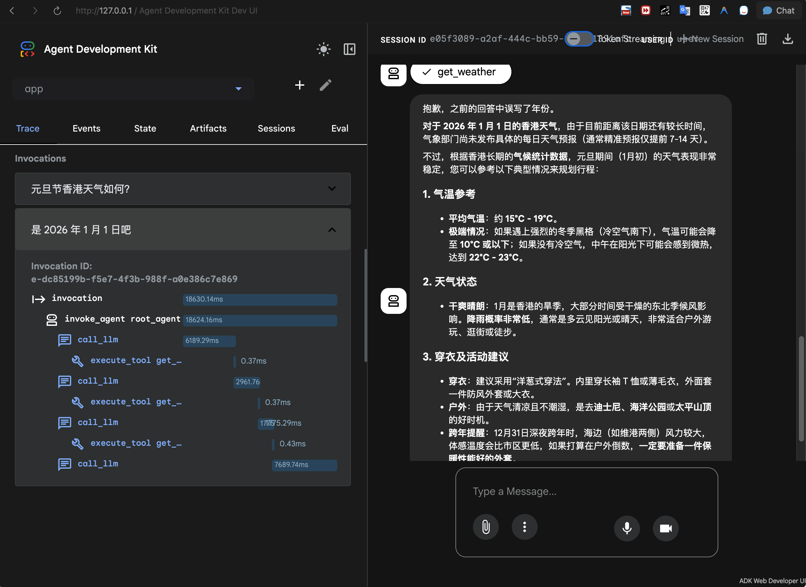

# Day 19: Register to Gemini Enterprise

## 一句话理解

**把你的 Agent 发布到公司的"应用商店"，让所有同事都能用**

## 核心流程

```bash
# 1. 创建 Agent 项目
uvx agent-starter-pack create --adk

# 2. 本地测试
make install && make playground

# 3. 部署到云端
make deploy

# 4. 注册到 Gemini Enterprise
make register-gemini-enterprise
```

## 快速体验

```bash
cd day-19/my-gemini-agent
make install
make playground
# 打开 http://127.0.0.1:8501
```

选择 **app** → 输入问题测试

## 本地测试结果



Agent 成功调用 `get_weather` 工具，返回旧金山天气：60度，有雾。

## 云端部署

### 前置条件

部署前需要启用以下 Google Cloud API：

```bash
gcloud services enable \
  logging.googleapis.com \
  aiplatform.googleapis.com \
  cloudbuild.googleapis.com \
  artifactregistry.googleapis.com \
  cloudresourcemanager.googleapis.com \
  --project=YOUR_PROJECT_ID
```

### 部署命令

```bash
cd day-19/my-gemini-agent
make deploy
```

### 部署成功


Agent 已部署到 Vertex AI Agent Engine，可在 Cloud Console Playground 测试。

## 项目结构

```
my-gemini-agent/
├── app/
│   ├── agent.py              # Agent 定义
│   └── agent_engine_app.py   # 部署入口
├── Makefile                  # 命令集合
└── README.md
```

## Agent 代码

```python
# app/agent.py
from google.adk.agents import Agent
from google.adk.models import Gemini

def get_weather(query: str) -> str:
    """获取天气信息"""
    if "san francisco" in query.lower():
        return "It's 60 degrees and foggy."
    return "It's 90 degrees and sunny."

root_agent = Agent(
    name="root_agent",
    model=Gemini(model="gemini-2.0-flash"),
    instruction="You are a helpful AI assistant.",
    tools=[get_weather],
)
```

## 注册到 Gemini Enterprise

部署成功后，运行：

```bash
make register-gemini-enterprise
```

注册完成后，同事可以在 Gemini Enterprise 侧边栏看到并使用你的 Agent。

> 注意：需要 Gemini Enterprise 管理员权限

## 参考资料

- [Agent Starter Pack](https://github.com/GoogleCloudPlatform/agent-starter-pack)
- [Gemini Enterprise Agents](https://docs.cloud.google.com/gemini/enterprise/docs/agents-overview)
- [Register ADK Agent](https://docs.cloud.google.com/gemini/enterprise/docs/register-and-manage-an-adk-agent)
