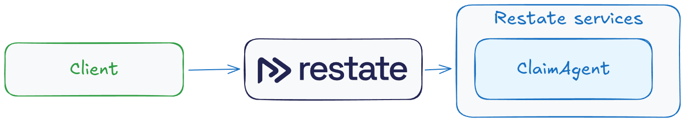
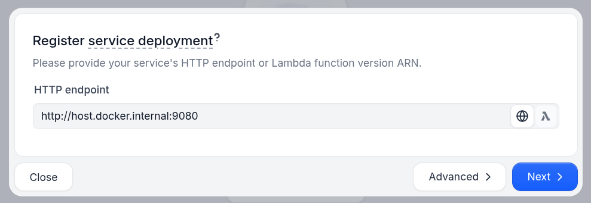
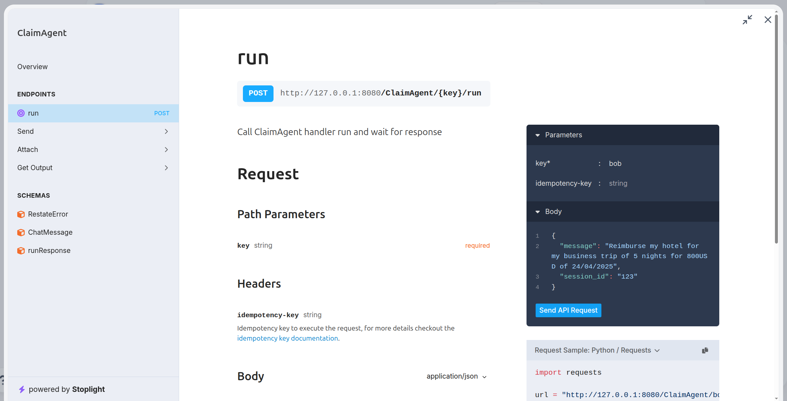
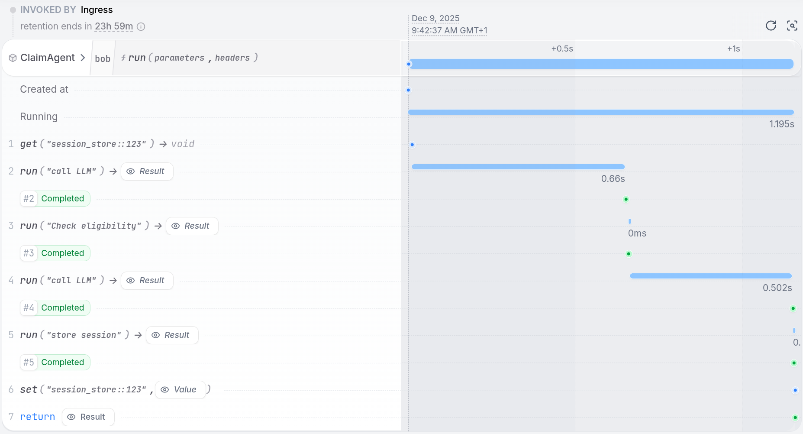
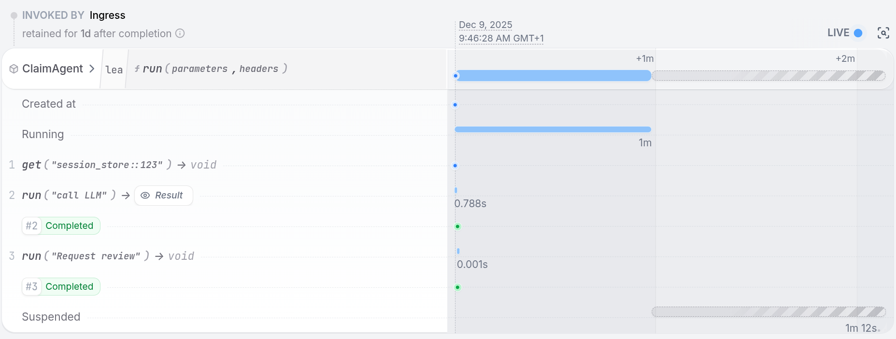
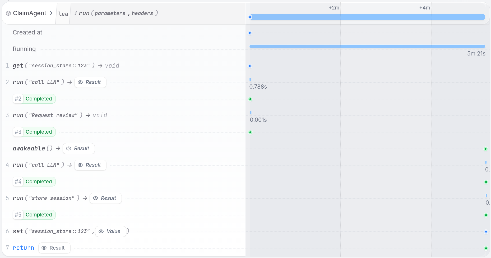

# Restate + Google ADK Example

**This integration is work-in-progress.**

This project demonstrates how to build resilient AI agents using [Restate](https://docs.restate.dev/ai) and [Google's Agent Development Kit](https://google.github.io/adk-docs/). The example shows a **claims processing agent** that can handle insurance or expense reimbursement requests with human approval workflows.

## What is Restate?

**Restate** is a platform that makes AI agents durable. Think of it as a safety net for your AI workflows.

With Restate, your AI agents can:
- ✅ **Never lose progress** - if your agent crashes, it picks up exactly where it left off
- ✅ **Wait for human approval** - pause execution for days/weeks until a human approves
- ✅ **Store context safely** - agent memory persists across restarts with built-in session management
- ✅ **Complete observability** - see exactly what your agent did and when
- ✅ **Handle failures gracefully** - automatic retries, timeouts, and error recovery
- ✅ **Run complex workflows** - orchestrate multiple agents, run tasks in parallel


## Prerequisites
- [Docker](https://www.docker.com/get-started/)
- [uv](https://uv.run/getting-started/installation)
- [Google API key](https://aistudio.google.com/app/api-keys)
- Python 3.11+

## Quick Start

Follow these steps to run the claims processing agent:



### 1. Set up your Google API key
Get a free API key from [Google AI Studio](https://aistudio.google.com/app/api-keys), then:
```bash
export GOOGLE_API_KEY=your-api-key
```

### 2. Start the AI agent
```bash
uv run .
```
Your agent is now running on `http://localhost:9080` and ready to process claims!

### 3. Start Restate (the durability engine)
Open a new terminal and run:
```bash
docker run  --name restate --rm \
  -p 8080:8080 \
  -p 9070:9070 \
  -v restate-data:/restate-data \
  -e RESTATE_NODE_NAME=restate-1 \
  --add-host host.docker.internal:host-gateway \
  docker.restate.dev/restatedev/restate:latest
```
This starts Restate's runtime that will cooperate with your agent, to make it durable.
It will store its data in a Docker volume called `restate-data` to persist across restarts.

### 4. Register your agent in Restate
1. Open the Restate UI: `http://localhost:9070`
2. Click **"Register Deployment"**
3. Enter your agent URL: `http://host.docker.internal:9080`
4. Click **"Register"**



### 5. Try your first claim!
1. Click on the **"run"** function of the `ClaimAgent` service
2. Fill in the `key` field with any customer ID (e.g., "customer123")
3. Click **"Send"** with the default request

This sends a simple reimbursement request to your agent!



In the invocations tab, you see the execution journal when clicking on the invocation ID:



## Durable Execution in action for Human Approval tools

Let's see how Restate makes your AI agent durable and reliable.
 
Let's trigger a workflow that requires human approval. In the Restate UI, send this request instead of the default one:
```
{
  "message": "Reimburse my hotel for my business trip of 5 nights for 1800USD of 24/04/2025",
  "session_id": "123"
}
```

The agent will process the request and then pause, waiting for human approval.



### Test the Durability
The curl command to approve is shown in the service logs:
```bash
curl localhost:8080/restate/awakeables/sign_.../resolve --json 'true'
```

Copy over the command, but **don't run it yet**.

First, try to break the agent:
1. ❌ Restart the agent process (Ctrl+C)
2. ❌ Wait for hours/days
3. ❌ Restart Restate (requires volume attached to the container) (Ctrl+C)

**The agent state is safely stored in Restate!** 
At any point in time, you can execute the curl command to approve the reimbursement and let the agent continue.



As you see, even after crashing and waiting, the agent wakes up and resumes exactly where it left off.

## Build Your Own Agent
This example shows just the basics. With Restate, you can build:
- [**Multi-agent systems**](https://github.com/restatedev/ai-examples/blob/main/google-adk/tour-of-agents/app/multi_agent.py) with resilient communication over HTTP
- **Long-running workflows** that span days or weeks
- **Complex approval chains** with timeouts and escalations
- [**Parallel task execution**](https://github.com/restatedev/ai-examples/blob/main/google-adk/tour-of-agents/app/parallel_agents.py) for faster processing with deterministic recovery
- **Stateful, serverless agents** that scale on demand

## Next Steps
Here are some resources to help you get started:
- **[Google ADK + Restate: tutorial](https://docs.restate.dev/tour/google-adk):** Explore more sample agents and learn how to build resilient multi-agent systems, human-in-the-loop workflows, and parallel execution.
- **[Restate AI Documentation](https://docs.restate.dev/ai)** - Learn to build durable AI agents
- **[Google ADK Documentation](https://google.github.io/adk-docs/)** - Learn more about Google's Agent Development Kit

 