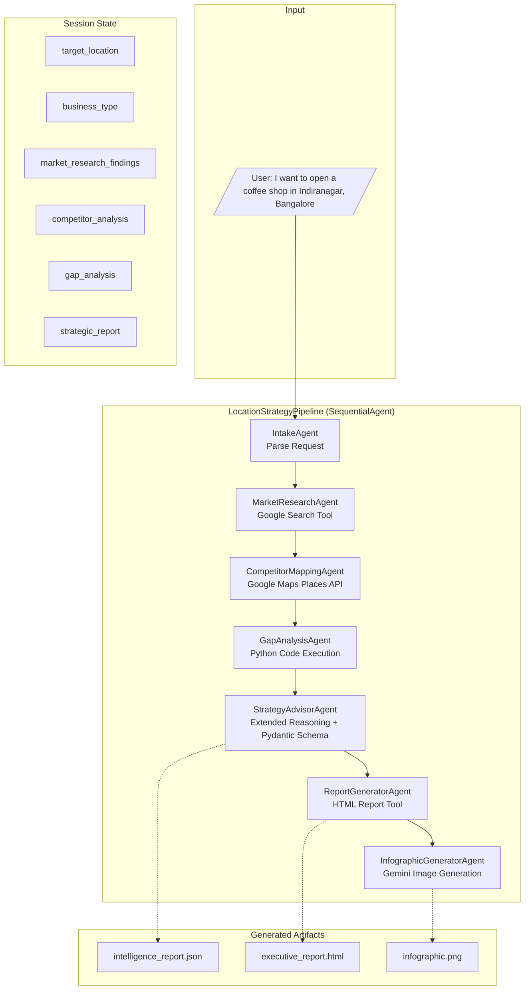

# Developer Guide: Retail AI Location Strategy

This guide provides in-depth documentation for developers who want to understand, extend, or customize the Retail AI Location Strategy pipeline.

## Table of Contents

- [The Business Problem](#the-business-problem)
- [Features](#features)
- [Architecture Deep Dive](#architecture-deep-dive)
- [Project Structure](#project-structure)
- [Agents and Tools](#agents-and-tools)
- [Configuration](#configuration)
- [Sample Outputs](#sample-outputs)
- [API vs Agent Comparison](#api-vs-agent-comparison)
- [Notebook Reference](#notebook-reference)
- [Troubleshooting](#troubleshooting)

---

## The Business Problem

### The "Synthesis Bottleneck"

Opening a physical retail location (e.g., a cafe, gym, or boutique) is a high-stakes investment often plagued by a lack of unified data:

- **Data Fragmentation**: Demographics are on Wikipedia, competitors are on Google Maps, rent trends are in news articles, and analysis needs to be done in spreadsheets.
- **Latency**: Validating a single location typically takes an analyst 1-2 weeks of manual research.
- **Risk**: Decisions are often made on "gut feeling" rather than data, leading to a high failure rate for new brick-and-mortar businesses.

### The Solution

An AI pipeline that unifies these disparate data sources into a coherent strategy in minutes, not weeks. This system acts as an autonomous analyst that:

- Searches the web for demographic and market trends
- Queries Google Maps for real competitor data
- Executes Python code to calculate saturation indices and viability scores
- Uses extended reasoning to synthesize findings into actionable recommendations
- Produces executive-ready reports and visualizations

---

## Features

- **7 Specialized Agents**: Each agent focuses on a specific task in the analysis pipeline
- **Real-time Web Search**: MarketResearchAgent uses Google Search for live market data
- **Google Maps Integration**: CompetitorMappingAgent uses Places API for real competitor data
- **Python Code Execution**: GapAnalysisAgent runs pandas code for quantitative analysis
- **Extended Reasoning**: StrategyAdvisorAgent uses thinking mode for deep strategic synthesis
- **Structured Output**: Pydantic schemas ensure consistent, parseable JSON output
- **Professional Reports**: McKinsey/BCG style 7-slide HTML executive presentations
- **Visual Infographics**: Native image generation using Gemini 3 Pro Image Preview
- **Retry Logic**: Built-in retry with exponential backoff for API rate limits
- **Lifecycle Callbacks**: Before/after hooks for logging, state tracking, and artifact management

---

## Architecture Deep Dive

### Pipeline Flow



### State Flow

Each agent reads from and writes to the shared session state:

```
User Input
    → IntakeAgent extracts: target_location, business_type
    → MarketResearchAgent produces: market_research_findings
    → CompetitorMappingAgent produces: competitor_analysis
    → GapAnalysisAgent produces: gap_analysis
    → StrategyAdvisorAgent produces: strategic_report (Pydantic model)
    → ReportGeneratorAgent produces: html_report
    → InfographicGeneratorAgent produces: infographic_result
```

### Agent Communication Pattern

Agents communicate through the shared session state using the `output_key` parameter:

```python
# Example from market_research.py
market_research_agent = LlmAgent(
    name="MarketResearchAgent",
    model=FAST_MODEL,
    instruction="Research {target_location} for {business_type}...",
    output_key="market_research_findings",  # Saves output to state
)
```

Variables in curly braces (e.g., `{target_location}`) are automatically injected from the session state.

---

## Project Structure

```
retail-ai-location-strategy/
├── Makefile                 # Build and run commands
├── pyproject.toml           # Dependencies and package config
├── uv.lock                  # Lockfile for reproducible builds
├── .env.example             # Environment template
├── README.md                # Quick start guide
├── DEVELOPER_GUIDE.md       # This file
│
├── app/                     # Agent package
│   ├── __init__.py          # Exports root_agent for ADK discovery
│   ├── agent.py             # Root SequentialAgent definition
│   ├── config.py            # Model and retry configuration
│   ├── .env                 # Environment variables (from .env.example)
│   │
│   ├── sub_agents/          # 7 specialized agents
│   │   ├── __init__.py
│   │   ├── intake_agent.py      # Parses user request
│   │   ├── market_research.py   # Web search for market data
│   │   ├── competitor_mapping.py # Maps API for competitors
│   │   ├── gap_analysis.py      # Python code execution
│   │   ├── strategy_advisor.py  # Extended reasoning + structured output
│   │   ├── report_generator.py  # HTML report generation
│   │   └── infographic_generator.py # Image generation
│   │
│   ├── tools/               # Custom function tools
│   │   ├── __init__.py
│   │   ├── places_search.py     # Google Maps Places API wrapper
│   │   ├── html_report_generator.py # HTML generation tool
│   │   └── image_generator.py   # Gemini image generation tool
│   │
│   ├── callbacks/           # Pipeline lifecycle callbacks
│   │   ├── __init__.py
│   │   └── pipeline_callbacks.py # Before/after hooks for all agents
│   │
│   ├── schemas/             # Pydantic output schemas
│   │   ├── __init__.py
│   │   └── report_schema.py     # LocationIntelligenceReport and related models
│   │
│   └── frontend/            # AG-UI interactive dashboard (optional)
│       ├── backend/         # FastAPI + ADKAgent wrapper
│       └── ...              # Next.js app
│
└── notebook/                # Original API-based implementation
    └── retail_ai_location_strategy_gemini_3.ipynb
```

---

## Agents and Tools

### Sub-Agents

| Agent | Purpose | Model | Key Feature | State Output |
|-------|---------|-------|-------------|--------------|
| **IntakeAgent** | Parse user request | FAST_MODEL | Extracts location and business type from natural language | `target_location`, `business_type` |
| **MarketResearchAgent** | Live web research | FAST_MODEL | Uses `google_search` built-in tool | `market_research_findings` |
| **CompetitorMappingAgent** | Find competitors | FAST_MODEL | Custom `search_places` tool with Maps API | `competitor_analysis` |
| **GapAnalysisAgent** | Quantitative analysis | CODE_EXEC_MODEL | `BuiltInCodeExecutor` for pandas analysis | `gap_analysis` |
| **StrategyAdvisorAgent** | Strategic synthesis | PRO_MODEL | Extended reasoning + Pydantic `output_schema` | `strategic_report` |
| **ReportGeneratorAgent** | HTML report | FAST_MODEL | `generate_html_report` tool | `html_report` |
| **InfographicGeneratorAgent** | Visual summary | FAST_MODEL | `generate_infographic` tool | `infographic_result` |

### Tools

#### search_places

Google Maps Places API integration for finding competitors.

```python
def search_places(query: str, tool_context: ToolContext) -> dict:
    """Search for places using Google Maps Places API."""
    api_key = tool_context.state.get("maps_api_key")
    # Returns: place names, ratings, review counts, addresses
```

#### generate_html_report

Creates a McKinsey/BCG style 7-slide HTML presentation.

```python
async def generate_html_report(report_data: str, tool_context: ToolContext) -> dict:
    """Generate professional HTML executive report."""
    # Uses Gemini to generate HTML with:
    # - Executive Summary slide
    # - Top Recommendation Details
    # - Competition Analysis
    # - Market Characteristics
    # - Alternative Locations
    # - Key Insights & Next Steps
    # - Methodology
```

#### generate_infographic

Creates visual infographics using Gemini 3 Pro Image Preview (`gemini-3-pro-image-preview`).

```python
async def generate_infographic(data_summary: str, tool_context: ToolContext) -> dict:
    """Generate infographic using Gemini's native image generation."""
    # Uses IMAGE_MODEL (gemini-3-pro-image-preview) with response_modalities=["TEXT", "IMAGE"]
```

### Callbacks

Pipeline callbacks provide lifecycle hooks for each agent:

| Callback Type | Purpose |
|---------------|---------|
| `before_*` | Log stage start, set current_date, initialize tracking state |
| `after_*` | Log completion, save artifacts, update progress |

Example usage:

```python
def before_market_research(callback_context: CallbackContext):
    logger.info("STAGE 1: MARKET RESEARCH - Starting")
    callback_context.state["current_date"] = datetime.now().strftime("%Y-%m-%d")
    callback_context.state["pipeline_stage"] = "market_research"
    return None  # Continue to agent

def after_strategy_advisor(callback_context: CallbackContext):
    # Save JSON artifact
    report = callback_context.state.get("strategic_report")
    json_artifact = types.Part.from_bytes(
        data=json.dumps(report).encode('utf-8'),
        mime_type="application/json"
    )
    callback_context.save_artifact("intelligence_report.json", json_artifact)
```

### Schemas

The `StrategyAdvisorAgent` outputs a structured `LocationIntelligenceReport` using Pydantic:

```python
class LocationIntelligenceReport(BaseModel):
    target_location: str
    business_type: str
    analysis_date: str
    market_validation: str
    total_competitors_found: int
    zones_analyzed: int
    top_recommendation: LocationRecommendation
    alternative_locations: List[AlternativeLocation]
    key_insights: List[str]
    methodology_summary: str

class LocationRecommendation(BaseModel):
    location_name: str
    area: str
    overall_score: int  # 0-100
    opportunity_type: str
    strengths: List[StrengthAnalysis]
    concerns: List[ConcernAnalysis]
    competition: CompetitionProfile
    market: MarketCharacteristics
    next_steps: List[str]
```

---

## Configuration

### Model Selection

Edit `config.py` to switch between model options:

```python
# config.py - Switch models by commenting/uncommenting
# NOTE: Gemini 2.5 Pro is RECOMMENDED for stability. Gemini 3 Pro Preview
#       may throw "model overloaded" (503) errors during high-demand periods.

# Option 1: Gemini 2.5 Pro (RECOMMENDED - stable, good for production)
FAST_MODEL = "gemini-2.5-pro"
PRO_MODEL = "gemini-2.5-pro"
CODE_EXEC_MODEL = "gemini-2.5-pro"
IMAGE_MODEL = "gemini-3-pro-image-preview"  # Gemini 3 for native image generation

# Option 2: Gemini 3 Pro Preview (latest features, may have availability issues)
# FAST_MODEL = "gemini-3-pro-preview"
# PRO_MODEL = "gemini-3-pro-preview"
# CODE_EXEC_MODEL = "gemini-3-pro-preview"
# IMAGE_MODEL = "gemini-3-pro-image-preview"

# Option 3: Gemini 2.5 Flash (fastest, lowest cost)
# FAST_MODEL = "gemini-2.5-flash"
# PRO_MODEL = "gemini-2.5-flash"
# CODE_EXEC_MODEL = "gemini-2.5-flash"
# IMAGE_MODEL = "gemini-2.0-flash-exp"
```

### Retry Configuration

```python
RETRY_INITIAL_DELAY = 5   # seconds
RETRY_ATTEMPTS = 5        # number of retries
RETRY_MAX_DELAY = 60      # maximum delay between retries
```

---

## Sample Outputs

After running the pipeline, check the **Artifacts** tab in the ADK Web UI to find:

### 1. intelligence_report.json
Structured JSON output from StrategyAdvisorAgent containing all analysis data.

### 2. executive_report.html
Professional 7-slide HTML presentation suitable for executive presentations.

### 3. infographic.png
Visual summary infographic generated by Gemini 3 Pro Image Preview.

---

## API vs Agent Comparison

The `notebook/` folder contains the original implementation using direct Gemini API calls. This ADK version transforms the same use-case into a multi-agent system.

### Why Agents?

The agent-based approach provides several advantages for complex, multi-step workflows:

| Aspect | Direct API (Notebook) | ADK Agents |
|--------|----------------------|------------|
| **Code Organization** | Single notebook with sequential cells | Modular agents, tools, and callbacks |
| **State Management** | Manual variable passing between cells | Automatic state injection via `output_key` |
| **Error Handling** | Manual try/catch in each cell | Built-in retry with `HttpRetryOptions` |
| **Extensibility** | Modify notebook cells directly | Add/remove/reorder agents declaratively |
| **Tool Integration** | Inline API calls mixed with logic | Declarative tool registration |
| **Structured Output** | Manual JSON parsing and validation | Native Pydantic schema support |
| **Reasoning** | Prompt engineering for each call | Built-in planner with thinking mode |
| **Observability** | print() statements for debugging | Lifecycle callbacks with hooks |
| **Deployment** | Run notebook manually | `adk web` or `adk run` commands |
| **Session State** | Lost between notebook runs | Persistent across conversation turns |
| **Conversational** | Single-shot execution | Multi-turn dialogue with context |

---

## Notebook Reference

The `notebook/` folder contains the original Gemini 3 implementation that inspired this ADK agent:

### Original Notebook Structure

| Part | Description | ADK Equivalent |
|------|-------------|----------------|
| **Part 1** | Market Research with Google Search | MarketResearchAgent |
| **Part 2A** | Competitor Mapping with Maps API | CompetitorMappingAgent |
| **Part 2B** | Gap Analysis with Code Execution | GapAnalysisAgent |
| **Part 3** | Strategy Synthesis with Extended Reasoning | StrategyAdvisorAgent |
| **Part 4** | HTML Report Generation | ReportGeneratorAgent |
| **Bonus** | Infographic with Image Generation | InfographicGeneratorAgent |

### Running the Notebook

The notebook can be run independently in:
- [Google Colab](https://colab.research.google.com/github/GoogleCloudPlatform/generative-ai/blob/main/gemini/use-cases/retail/retail_ai_location_strategy_gemini_3.ipynb)
- [Vertex AI Workbench](https://console.cloud.google.com/vertex-ai/workbench)
- Any Jupyter environment

---

## Troubleshooting

### Model Overload (503 errors)

If you encounter `503 UNAVAILABLE - model overloaded` errors:

1. Switch to a more stable model in `config.py`:
   ```python
   FAST_MODEL = "gemini-2.5-pro"
   PRO_MODEL = "gemini-2.5-pro"
   ```
2. Increase retry attempts and delays
3. Wait a few minutes and try again

### Places API Errors

- Verify `MAPS_API_KEY` is set correctly in `app/.env`
- Ensure Places API is enabled in Google Cloud Console
- Check API key restrictions (should allow Places API)

### Import Errors

- Verify all `__init__.py` files export required modules
- Check that dependencies are installed: `uv sync` (or `make install`)

### Artifacts Not Showing in UI

- Ensure artifacts use `Part.from_bytes()` with proper MIME type:
  ```python
  types.Part.from_bytes(data=content.encode('utf-8'), mime_type="text/html")
  ```

### State Variables Not Found

- Check that previous agent has `output_key` set
- Verify variable names match exactly (case-sensitive)
- The `current_date` is set in each agent's `before_*` callback

---

## Authors and Attribution

This ADK implementation is based on the original Gemini 3 notebook created for Google Cloud Platform:

**Original Notebook Authors:**
- [Deepak Moonat](https://github.com/dmoonat)
- [Lavi Nigam](https://github.com/lavinigam-gcp)

**Original Notebook:**
[Retail AI Location Strategy - Gemini 3](https://github.com/GoogleCloudPlatform/generative-ai/blob/main/gemini/use-cases/retail/retail_ai_location_strategy_gemini_3.ipynb)

The notebook demonstrates Gemini 3's capabilities for:
- Advanced reasoning and complex instruction following
- Agentic operations and autonomous code execution
- Multimodal understanding and generation
